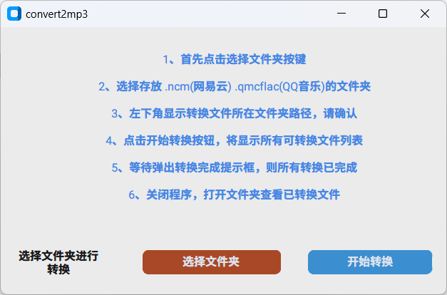

# ncm2mp3

1、支持 **.ncm,.qmc0,.qmc3,.qmflac** 转换为 **.mp3,.flac** 文件


2、支持通过 .ncm下载 .lrc 歌词，同时支持将歌词嵌入 .mp3 文件

3、.qmc0,.qmc3,.qmflac 暂不支持歌词文件

4、主界面预览




ncm2mp3.py 主要功能基于 [Ncm2Music](https://github.com/crmmc/Ncm2Music) 添加 GUI

ncm2mp3.spec : Pyinstaller 打包配置文件

CustomTkinter 打包命令 :

```bash
pyinstaller --noconfirm --onedir --windowed --add-data "<CustomTkinter Location>/customtkinter;customtkinter/"  -F "<Path to Python Script>"
```

GUI 使用 [CustomTkinter](https://github.com/TomSchimansky/CustomTkinter)

icon来自iconfont 作者 : [outlet-](https://www.iconfont.cn/user/detail?spm=a313x.7781069.0.d214f71f6&uid=166576&nid=s1KerORysH04#:~:text=%EE%98%B5-,%E7%88%B5%E5%A3%AB%E9%9F%B3%E4%B9%90,-%E6%95%B0%E9%87%8F%20%C2%A0%2020)


